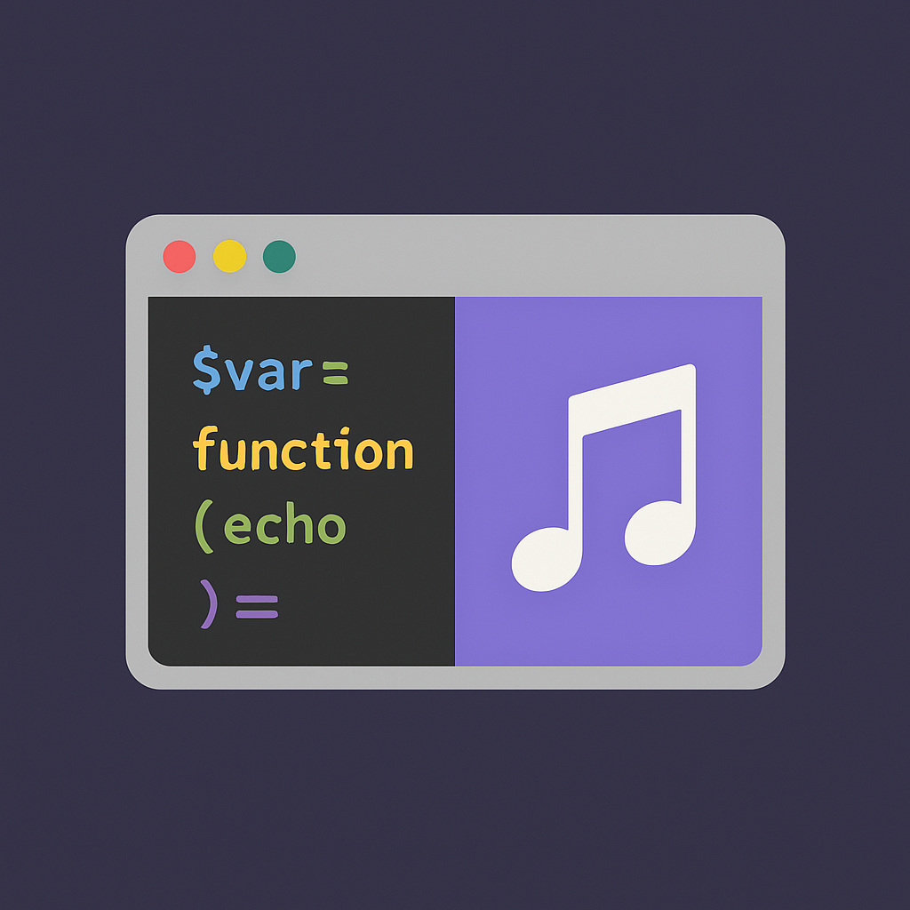

```javascript
/*
  █████╗ ███╗   ██╗ █████╗ ███████╗████████╗ █████╗ ███████╗██╗ █████╗ 
 ██╔══██╗████╗  ██║██╔══██╗██╔════╝╚══██╔══╝██╔══██╗██╔════╝██║██╔══██╗
 ███████║██╔██╗ ██║███████║███████╗   ██║   ███████║███████╗██║███████║
 ██╔══██║██║╚██╗██║██╔══██║╚════██║   ██║   ██╔══██║╚════██║██║██╔══██║
 ██║  ██║██║ ╚████║██║  ██║███████║   ██║   ██║  ██║███████║██║██║  ██║
 ╚═╝  ╚═╝╚═╝  ╚═══╝╚═╝  ╚═╝╚══════╝   ╚═╝   ╚═╝  ╚═╝╚══════╝╚═╝╚═╝  ╚═╝

 > Fullstack Developer | Code Mentor | Music Lover
 > I'm Anastasia, combining the art of coding with the rhythm of music 🎸
*/

// 🚀 **Daily Development Toolbox**
$stack = [
  "PHP", "AJAX", "jQuery", "DataTables",
  "JavaScript", "MySQL", "HTML", "CSS",
  "Bootstrap", "APIs", "POSTMAN", "SCRUM",
  "Git", "Bitbucket", "GitHub", "Monday.com"
];

// 🧠 **Skills I always keep in mind**
$extraSkills = [
  "React", "Node.js", "Docker", "Workbench"
];

// 🎯 **My current role**
$currentRole = "Fullstack Developer in my current position";
$isMentor = true;

// 🎧 **Passions outside of coding**
$hobbies = ["Playing violin 🎻 and piano 🎹", "Exploring new technologies 💻"];

```


### ✨ **About me**
I am a **fullstack** developer with real experience solving problems with code and empathy.
With a special focus on **backend with PHP**, I love building **dynamic interfaces** that offer a smooth and intuitive user experience, all backed by the efficiency of **jQuery** and **DataTables**.

### 💬 **Mentor and passionate about teaching**: I love helping others grow and improve their skills by sharing experiences and knowledge.  
📚 Always looking for new tools, languages, and frameworks to keep learning.  
🎶 The logic of code has rhythm, just like music.
<div align="center">
  
</div>

### 🔥 **Things I've done recently**
- Building clean, reactive interfaces with Bootstrap + JS
- Consuming and documenting **REST APIs** with **Postman** to improve integration and performance.
- Automating internal workflows
- **Mentoring** and code reviews for new team members, helping them integrate and improve their skills.
- Git flow with Bitbucket and Monday as an agile operational base

### 🧠 **My evolving skills** 
- 🌐 Node.js + Express  
- ⚛️ React
- 🐳 Docker for agile environments  
- 📐 Workbench for design and queries  

### 📬 **How to contact me?**
- [LinkedIn](https://www.linkedin.com/in/anastasia-kosovets-00022917b)  
- [GitHub](https://github.com/AnastasiaKosovets)  
- [Email](mailto:anastasiakosovets@gmail.com)

### 🎤 **End of the script**
Thanks for visiting my README. May the code and rhythm be with you!


```javascript
/* 
  ╔══════════════════════════════════════════════════╗
  ║  Fullstack Developer | Code Mentor | Music Lover  ║
  ║  Soy Anastasia, y combino el arte del código con   ║
  ║  el ritmo de la música 🎸                          ║
  ╚══════════════════════════════════════════════════╝
*/

// 🚀 **Tecnologías con las que navego en mi día a día**
$stack = [
  "PHP", "AJAX", "jQuery", "DataTables",
  "JavaScript", "MySQL", "HTML", "CSS",
  "Bootstrap", "APIs", "POSTMAN", "SCRUM",
  "Git", "Bitbucket", "GitHub", "Monday.com"
];

// 🧠 **Conocimientos que tengo siempre en mente**
$extraSkills = [
  "React", "Node.js", "Docker", "Workbench"
];

// 🎯 **Mi rol actual**
$currentRole = "Fullstack Developer en mi puesto actual";
$isMentor = true;

// 🎧 **Pasiones fuera del código**
$hobbies = ["Tocar violín 🎻 y piano 🎹", "Explorar nuevas tecnologías 💻"];

```

### ✨ **Sobre mí**
Soy una desarrolladora **fullstack** con experiencia real resolviendo problemas con código y empatía.
Con un enfoque especial en **backend con PHP**, me encanta crear **interfaces dinámicas** que ofrezcan una experiencia de usuario fluida e intuitiva, todo ello respaldado por la eficiencia de **jQuery** y **DataTables**.

### 💬 **Mentora y apasionada por la enseñanza**: Me encanta ayudar a otros a crecer y mejorar sus habilidades, compartiendo experiencias y conocimientos.     
📚 Siempre busco nuevas herramientas, lenguajes y frameworks para seguir aprendiendo.    
🎶 La lógica del código tiene ritmo, igual que la música.
<div align="center">
  
</div>

### 🔥 **Cosas que he hecho recientemente**
- Construcción de interfaces reactivas y limpias con Bootstrap + JS
- Consumo y documentación de **APIs REST** con **Postman** para mejorar la integración y el rendimiento.
- Automatización de flujos internos
- Mentoría y revisión de código para nuevos miembros del equipo, facilitando su integración y ayudándolos a potenciar sus habilidades.
- Git flow con Bitbucket y Monday como base operativa ágil

### 🧠 **Mis habilidades en constante evolución**

- 🌐 Node.js + Express  
- ⚛️ React
- 🐳 Docker para entornos ágiles  
- 📐 Workbench para diseño y queries  


### 📬 **¿Cómo contactarme?**
- [LinkedIn](https://www.linkedin.com/in/anastasia-kosovets-00022917b)  
- [GitHub](https://github.com/AnastasiaKosovets)  
- [Email](mailto:anastasiakosovets@gmail.com)

### 🎤 **Cierre del script**
Gracias por visitar mi README. ¡Que el código y el ritmo te acompañen!

